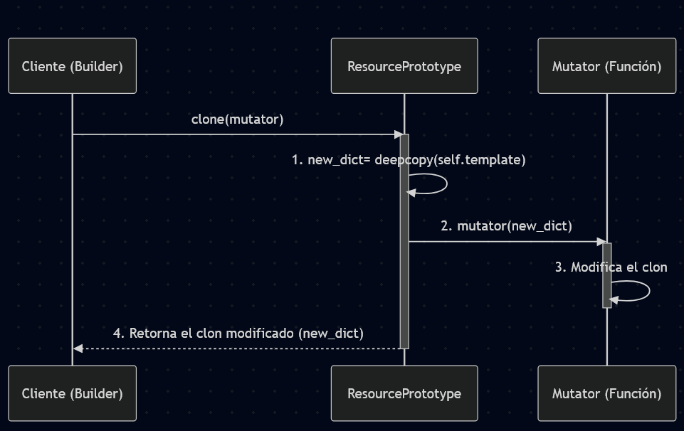

## Fase 1: Exploración y análisis

### Patrón Singleton

Tarea: Explica cómo SingletonMeta garantiza una sola instancia y el rol del lock.

Que solo se cree una sola instancia ocurre en el método `__call_` de  la clase SinfletonMeta, lo que hace es verificar el registro, si no está en `_instances` es decir que es la primera vez que se pide crea el objeto ConfigSingleton y guarda la nueva instancia en `_instances`. Si por el contrario la clase sí está en `_instances`, signiifica que ya fue creada antes, el código omite la creación y simplemente devuevle la instancia guardada.

El `lock` es una medida de seguridad en multi-threaded, explicado de manera simple es como una llave o un seguro para entrar a una habitación, si alguien es decir un proceso ya la tiene el otro no puede ingresar, así garantiza que solo un hilo lo ejecute, en este caso la verificación y creación de la instancia sea solo una y evitar race conditions.

### Factory

Tarea: Detalla cómo la fábrica encapsula la creación de null_resource y el propósito de sus triggers.

El script `factory.py` encapsula todo con el método estático `create()`, lo que hace es que llama `NullResourceFactory.create("arg")` este script se encarga de todo, anida los diccionarios y devuelve el JSON completo.

El propósito de los triggers son para que se detecten cambios cuando se use `terraform apply`, además también garantiza idempotencia ya que cada vez que se ejectue el script `generate_infa.py` seañaden dos triggers únicos ("factory_uuid": str(uuid.uuid4()), "timestamp": datetime.utcnow().isoformat()).

### Prototype

Tarea: Dibuja un diagrama UML del proceso de clonación profunda y explica cómo el mutator permite personalizar cada instancia.

En mi diagrama el Cliente llama al método clone() del ResourcePrototype y le pasa la función mutator, el ResourcePrototype se activa y crea una copia de su template interno, luego llama a la función mutator y le entrega el new_dict, acá el mutator modifica la copia y es devuelta por ResourcePrototype al Cliente.

El mutator es la función que se pasa como argumento al método clone. Es un función que se puede llamar y que puede aceptar un argumento que en este caso es el diccionario que se ha clonado, además como el mutator actúa sobre un new_dict lo modifica sin cambiar el template original.

### Composite

Tarea: Describe cómo CompositeModule agrupa múltiples bloques en un solo JSON válido para Terraform.

El CompositeModule actúa como un contenedor grande que permite tartar a un grupo de recursos como si fuera uno. Usa el método `.add()` para guardar cada bloque de recurso individual en un lista interna. Cuando termina de añadir bloques y llama a`.export`, el método recorre la lista y fusiona todos los diccionarios en un JSON.

### Builder

Tarea: Explica cómo InfrastructureBuilder orquesta Factory → Prototype → Composite y genera el archivo JSON final

Cuando se crea InfrastructureBuilder se crea una instancia de CompositeModule y se guarda en self.module. Cuando se llama a .build_null_fleet(), el Builder primero usa la Factory para crear un único recurso, luego este recurso se usa ene l patrón Prototype(ResourcePrototype(base)), finalmente entra a un bucle donde se usa clone para copiar el recurso varias veces y se aplica mutator para dar un nombre único. A cada clon el Builder lo añade a CompositeModuile interno,  se llama a .export() y el Builder le pide  CompositeModule que haga  un JSON con todos los recursos en un solo diccionario. El Builder toma el diccionario final y lo escribe en el archivo main.tf.json.